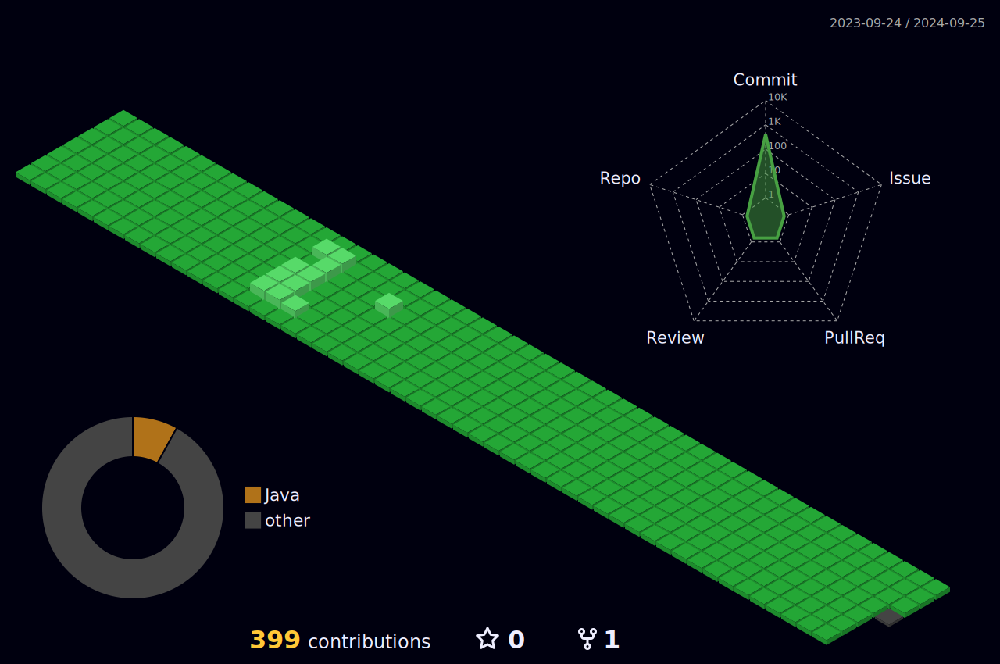

안녕하세요? 알에서 나오고 있는 주니어 개발자 홍수희 입니다!

<h2> 🛠Tech stack 🛠</h2>
  
	
  
  
	 
	
  
  
	 
	
	
  
   

 

  <h2>💻GitHub stats💻</h2>
  

 

  <h2>✨Most used languages✨</h2>
    

 

	<h2>🧩Profile 3D🧩</h2>

 

	
저의 학습용 github 계정 입니다. : https://github.com/HongGuma-study 

<!--
**HongGuma/HongGuma** is a  _special_ ✨ repository because its `README.md` (this file) appears on your GitHub profile.

Here are some ideas to get you started:

- 🔭 I’m currently working on ...
- 🌱 I’m currently learning ...
- 👯 I’m looking to collaborate on ...
- 🤔 I’m looking for help with ...
- 💬 Ask me about ...
- 📫 How to reach me: ...
- 😄 Pronouns: ...
- ⚡ Fun fact: ...
-->
